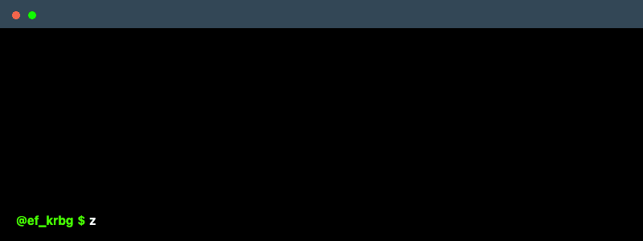

<!--
    Hey there, I'm Enes F. Karabag!
    Happy to see you here exploring my README code
    Feel free to inspire! :3
-->

 

<!--
    Your own Terminal GIF can be created here -> https://www.terminalgif.com
-->

    

<!--
     This is the list of my skills and tools I am studying!
-->
### Main skills

### Studying

### Connect with me!

    

<!--
     Oh, hello there, recruiters!
-->

<!--
     Thanks for being my guest <3
-->
